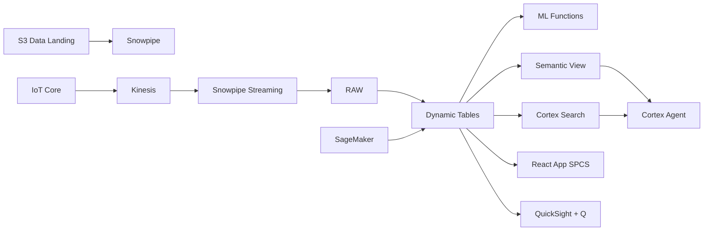

# Precision Agriculture & Yield Forecasting

IoT-powered precision farming for Malaysian palm oil estates — soil sensors stream to Snowflake, ML.FORECAST predicts Fresh Fruit Bunch yields, and Cortex Complete analyzes drone imagery for nutrient deficiency.

## Architecture

A Malaysian palm oil group manages 50 estates across 120,000 hectares in Johor, Pahang, and Sabah. Average FFB yield is 22.4 tonnes per hectare — well below the MPOB target of 25 tonnes. Three estates have dropped below the critical 20-tonne threshold. IoT soil sensors reveal nutrient deficiencies, drone imagery confirms the diagnosis, and ML forecasts predict continued decline without intervention.



## Snowflake Capabilities

| Capability | Implementation |
|-----------|---------------|
| Dynamic Tables | ESTATE_YIELD_SUMMARY / YIELD_TIMESERIES / SOIL_HEALTH_INDEX / PEST_DISEASE_ALERTS |
| ML Functions | ML.FORECAST + ML.ANOMALY_DETECTION |
| Cortex AI | COMPLETE_MULTIMODAL, SUMMARIZE, AI_CLASSIFY |
| Cortex Search | 80 documents indexed |
| Cortex Agent | PRECISION_AG_AGENT |
| Semantic View | PRECISION_AG_ANALYTICS |
| React App (SPCS) | 5 tabs + DemoGuide |


## AWS Services

| Service | Role in Demo |
|---------|-------------|
| AWS IoT Core | Ingest soil sensor telemetry from 50 estates (200K readings) |
| Amazon Kinesis | Stream sensor data to Snowpipe Streaming |
| Amazon SageMaker | Satellite NDVI analysis and yield regression models |
| Amazon S3 | Store drone imagery and satellite data |
| Amazon QuickSight + Q | Estate performance dashboard with natural language queries |
| AWS Lambda | Trigger irrigation and fertilizer alerts from sensor thresholds |


## Personas

| Persona | Role | Key Questions |
|---------|------|---------------|
| **Encik Azman bin Yusof** | Estate Director | "Which estates are below yield target?" "What's our forecasted FFB production for next quarter?" |
| **Kavitha a/p Subramaniam** | Agronomist | "What's causing the yield decline in Estate Kluang?" "Show me the NDVI analysis for Block 7." |


## Data

| Table | Rows | Description |
|-------|------|-------------|
| ESTATES | 50 | Oil palm estates with location, planted area, and palm age profile |
| SENSOR_READINGS | 200,000 | IoT soil sensors (moisture, pH, NPK, temperature) at 15-min intervals |
| HARVEST_RECORDS | 100,000 | Fresh Fruit Bunch (FFB) harvest records by block and round |
| WEATHER_DATA | 365 | Daily weather (rainfall, temperature, humidity) per estate region |
| AGRONOMY_DOCS | 80 | MPOB best practice guides, fertilizer recommendations, pest management SOPs |
| DRONE_IMAGERY | 2,000 | Drone and satellite NDVI imagery metadata with stage file references |
| FELDA_BENCHMARKS | 20 | FELDA and MPOB national yield benchmarks by palm age |


## Build Instructions

### Prerequisites
- Snowflake account with ACCOUNTADMIN access
- Cortex AI enabled (ML Functions, Search, Agent)
- Warehouse: PRECISION_AG_WH (Medium)
- AWS CLI with access (us-west-2)

### Deployment

```bash
snowsql -f snowflake/00_setup.sql
snowsql -f snowflake/01_marketplace_install.sql
snowsql -f snowflake/02_raw_tables.sql
snowsql -f snowflake/03_staging.sql
snowsql -f snowflake/04_dynamic_tables.sql
snowsql -f snowflake/05_search.sql
snowsql -f snowflake/06_ml_models.sql
snowsql -f snowflake/07_semantic_view.sql
snowsql -f snowflake/08_agent.sql
```

### React App (SPCS)
```bash
cd app && npm ci && npm run build
docker build -t aws-malaysia-palm-oil-precision-ag-app .
docker push bdiqc8sm-default.registry.snowflakecomputing.com/palm_oil_precision_ag/app/aws_malaysia_palm_oil_precision_ag/app:latest
```

### Demo Mode
Open the app URL with `?demo=true` for presenter view.

## Build Modes

### Snowflake Only
Run scripts 00-08 (skip AWS-specific integration). Uses:
- **Snowpipe Streaming SDK** instead of AWS IoT Core
- **Snowpipe Streaming SDK (direct)** instead of Amazon Kinesis
- **ML.FORECAST + Cortex Complete (multimodal)** instead of Amazon SageMaker
- **Snowflake Internal Stage + Directory Tables** instead of Amazon S3
- **Snowflake Intelligence (Cortex Analyst)** instead of Amazon QuickSight + Q
- **Snowflake Alerts + Notification Integration** instead of AWS Lambda

### Full AWS + Snowflake
Run all scripts including AWS integration. Deploy QuickSight dashboard from `quicksight/`.

## Business Impact

Industry research and Snowflake customer outcomes:
- **Malaysia is world's 2nd largest palm oil producer with 5.7M hectares — MPOB targets 4.5 tonnes/ha national average** — [MPOB Statistics](https://bepi.mpob.gov.my/)
- **Malaysian palm oil revenue was RM85B ($18B) in 2024 — smallholders (40% of area) average only 3.2 tonnes/ha** — [MPOB Annual Report](https://bepi.mpob.gov.my/)
- **Felda (world's largest palm oil plantation operator) deploying drone-based health monitoring across 850,000 hectares** — [Felda Global Ventures](https://www.fgvholdings.com/sustainability/)
- **Sime Darby achieved 12% yield increase on pilot plots using ML-based fertilizer and harvest optimization** — [Sime Darby Plantation](https://www.simedarbyplantation.com/sustainability/environmental-management)

## Key Demo Numbers

- **50 estates, 120,000 ha** total managed area across Johor, Pahang, and Sabah
- **22.4 t FFB/ha** current average yield (target: 25 t/ha)
- **3 estates** below critical 20 t/ha threshold
- **RM 1.2B** annual harvest value
- **200K sensor readings** IoT soil data streamed to Snowflake
- **2,000 drone images** analyzed by Cortex Complete (multimodal)
- **5 of 8 weeks** anomalous for Estate Kluang (ML.ANOMALY_DETECTION)


## License

Apache 2.0 — See [LICENSE](LICENSE) for details.

This is a personal demo project and is not an official Snowflake offering. It comes with no support or warranty.